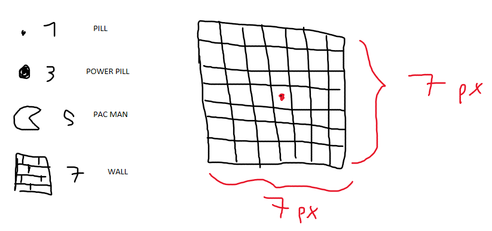
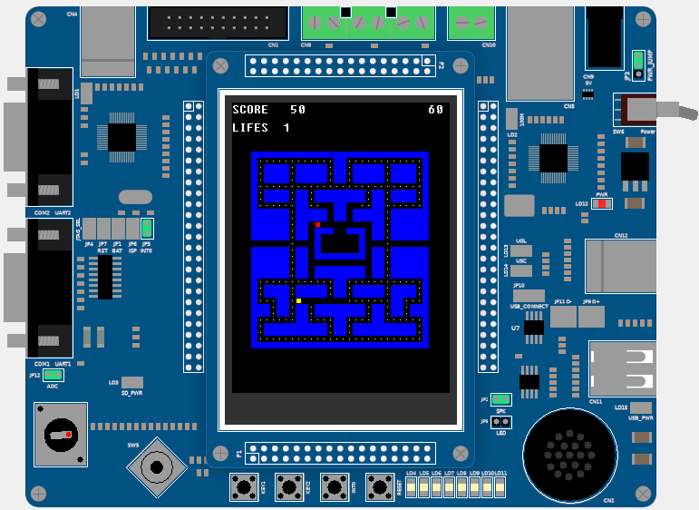

# PAC-MAC on a LandTiger LPC1768 board
The following project is an optional assignment for the 24/25 course Computer Architectures
at Polytechnic University of Turin.

The assignment consisted in creating the pacman game on the board and making it playable using
the joystick and the GLCD screen. Only one ghost (blinky) was needed in the requested game.

## Idea
To create the map I used a 31×28 matrix of integer: in each cell there can be a wall, a pill, a power pill or it
can be empty.
To map the matrix on the screen I associated each cell with a 7×7px square on the GLCD so that the square can be identified
by one "logical" central pixel. In this way, knowing the central pixel of the square and its associated cell I can draw the element
in the square.

    

## How does it work?
The map is drawn using a function that reads the matrix a fill the GLCD with wall blocks and basic pills (the power pills are spawned at random time and position using
the potentiometer values sampled with the ADC as a seed).

    

Each 50ms the joystick position is captured and saved in a variable *position* which is read by the pacman movement handler (a timer interrupt handler). Pacman can eat the pills for 50pts and power pills for 100pts. The player wins the game if he/she eat
all the pills before the timer expires, otherwise the game is lost.

While pacman moves, our yellow hero will be followed by a red ghost that will get faster as the game progresses. After pacman moves, the ghost AI will compute the best direction to move on to reach pacman. Note that, as in the original game, blinky won't chose the opposite direction to the one he is currently following.

If pacman eat a power pill the ghost will go in the frightened mode and try to escape pacman: the ghost AI will choose random direction.

## Game controls
- **int0** : starts the game and pause it
- **joystick** : moves pacman through the map, just select the direction desired and pacman will follow it unless you choose a new one
- **potentiometer** : to achieve a better randomness, move the potentiometer before each game

The score and the lifes of pacman are written on top of the GLCD.